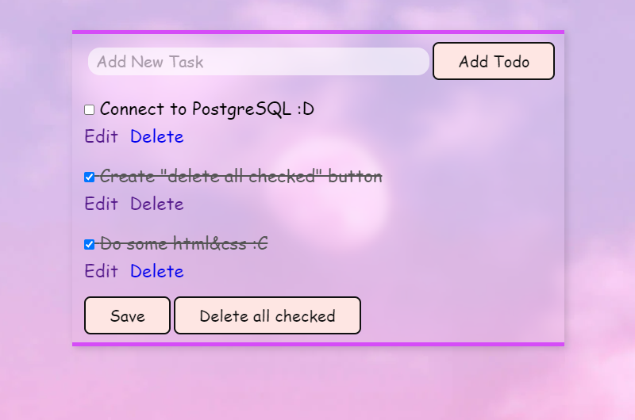

# 📝 To Do List - Web Application
Welcome to the To Do List web application, built using Python and the Flask framework! This project allows users to manage tasks with ease, providing a simple, clean interface to add, edit, and delete items from your to-do list.

The app is fully containerized using Docker, ensuring that it runs smoothly in any environment. The next steps in development include connecting the application to a PostgreSQL database, which will also be containerized to maintain a consistent and scalable environment.

## 🚀 Features
- Add, edit, and delete tasks in a to-do list
- Containerized using Docker for easy deployment
- Designed with future integration with PostgreSQL database
- Simple, clean interface for an optimal user experience
## 🛠 Skills and Tools Used
During this project, I gained valuable experience in several key areas, including:

- Flask: Developing web applications using Python
- Docker:
 - Creating a Dockerfile to containerize the app
 - Building and running Docker images
 - Managing containers efficiently
- Docker Compose (future implementation for multi-container architecture)
- PostgreSQL: Future implementation for database management

## 🐋 Docker Setup
To get the app up and running using Docker, follow these steps:

1. Clone the repository:

```bash
    git clone https://github.com/jakubZimnyGit/ToDoList.git
    cd ToDoList
```

2. Build the Docker image:

```bash
    docker build -t image_name:tag .
```

3. Run the container

```bash
    docker run -p 3000:3000 image_name:tag .
```

4. Open the app in your browser

```bash
    http://localhost:3000
```



## 🔧 Future Development
- PostgreSQL database integration to store tasks
- Docker Compose setup to manage multiple containers (Flask app + Postgres)
- Improved user interface and additional features like user authentication

## 🧑‍💻 Contact
Feel free to reach out if you have any questions or suggestions for the project!
